# 🎯 End-to-End CTR Prediction & Business Impact Analysis

<p align="center">
  
  
  
  
  
</p>

> **Can we predict whether a user will click on an ad — before they even see it?**
>
> This project answers that question end-to-end: from raw user behavioral data, through exploratory analysis, to a production-grade classifier achieving **97%+ accuracy** — and then translates those predictions into **real business value for ad spend optimization**.

---

## 📖 Table of Contents

1. [The Business Problem](#-the-business-problem)
2. [Dataset Overview](#-dataset-overview)
3. [Project Architecture](#-project-architecture)
4. [Exploratory Data Analysis](#-exploratory-data-analysis)
5. [Data Preprocessing & Feature Engineering](#-data-preprocessing--feature-engineering)
6. [Modeling](#-modeling)
7. [Hyperparameter Tuning](#-hyperparameter-tuning)
8. [Final Model & Results](#-final-model--results)
9. [Feature Importance & Business Insights](#-feature-importance--business-insights)
10. [Business Impact](#-business-impact)
11. [Project Structure](#-project-structure)
12. [Installation & Usage](#-installation--usage)
13. [Key Takeaways](#-key-takeaways)

---

## 💼 The Business Problem

In digital advertising, **Click-Through Rate (CTR)** is the critical metric that determines the effectiveness of ad campaigns. Every ad impression is a cost. Every non-click is a missed opportunity. For businesses spending millions on online advertising:

- Showing ads to the **wrong audience wastes budget**
- Showing ads to the **right audience maximizes ROI**

**The question becomes:** *Given what we know about a user — their demographics, browsing behavior, and context — how likely are they to click on an ad?*

This project builds a **binary classifier** to answer that question, enabling:
- 🎯 **Precise audience targeting** — serve ads only to high-probability clickers
- 💰 **Reduced wasted ad spend** — avoid costly impressions on uninterested users
- 📈 **Higher campaign ROI** — maximize conversions per dollar spent

---

## 📊 Dataset Overview

The dataset (`Clicked_Ads_Dataset.csv`) contains **1,000 records** of user sessions with the following features:

| Feature | Type | Description |
|---|---|---|
| `Daily Time Spent on Site` | Numerical | Minutes spent on the site per day |
| `Age` | Numerical | User's age |
| `Area Income` | Numerical | Average income in the user's geographic area |
| `Daily Internet Usage` | Numerical | Average daily internet usage in minutes |
| `Ad Topic Line` | Categorical | The topic/headline of the ad |
| `City` | Categorical | User's city |
| `Male` | Binary | Gender (1 = Male, 0 = Female) |
| `Timestamp` | DateTime | Date and time of the session |
| `Clicked on Ad` | Binary | **Target** — 1 = Clicked, 0 = Did Not Click |
| `Country` | Categorical | User's country |

**Class Balance:** The dataset is perfectly balanced — **50% clicked, 50% did not click** — making accuracy a reliable baseline metric.

---

## 🏗️ Project Architecture

```
Raw Data
    ↓
Exploratory Data Analysis (EDA)
    ↓
Data Cleaning & Preprocessing
    ↓
Feature Engineering (Temporal Features + Encoding)
    ↓
Model Baseline (6 Classifiers)
    ↓
Hyperparameter Tuning (GridSearchCV)
    ↓
Advanced Models (CatBoost)
    ↓
Best Model Selection & Evaluation
    ↓
Feature Importance & Business Insights
```

---

## 🔍 Exploratory Data Analysis

### The Story the Data Tells

Before building any model, we asked: **what patterns separate users who click from those who don't?**

#### Distribution of Numerical Features

The four continuous features (`Daily Time Spent on Site`, `Age`, `Area Income`, `Daily Internet Usage`) show distinct distributional properties:

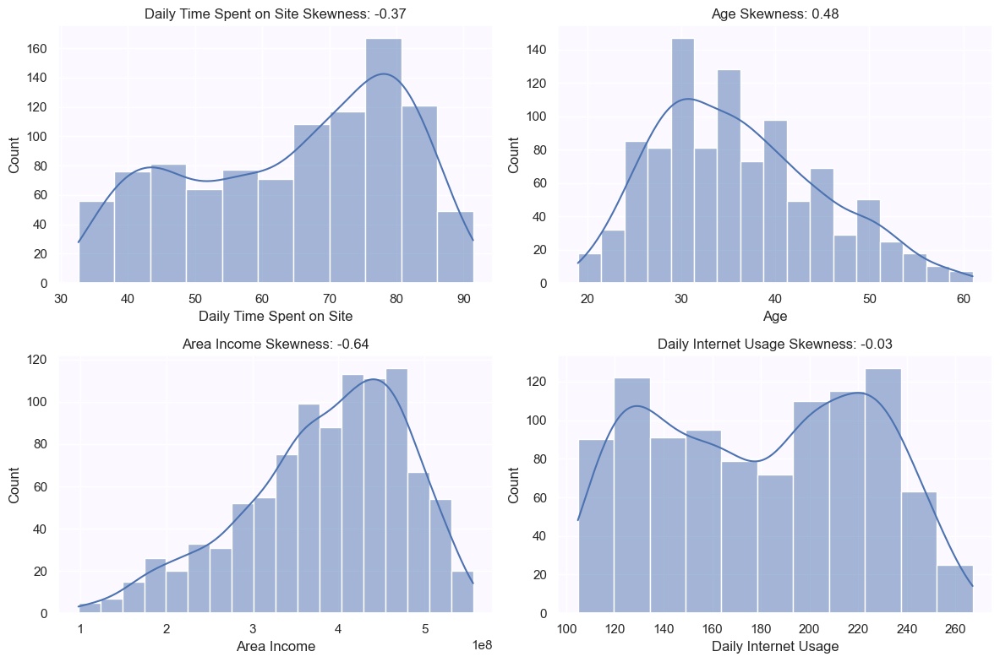

- **Area Income** is **left-skewed** — most users come from relatively prosperous areas, but a long tail of lower-income areas pulls the distribution left. This has implications for imputation strategy.
- **Age** is roughly bell-shaped, centered around mid-thirties.
- **Daily Time Spent on Site** and **Daily Internet Usage** are more symmetric.

#### Outlier Detection via Boxplots

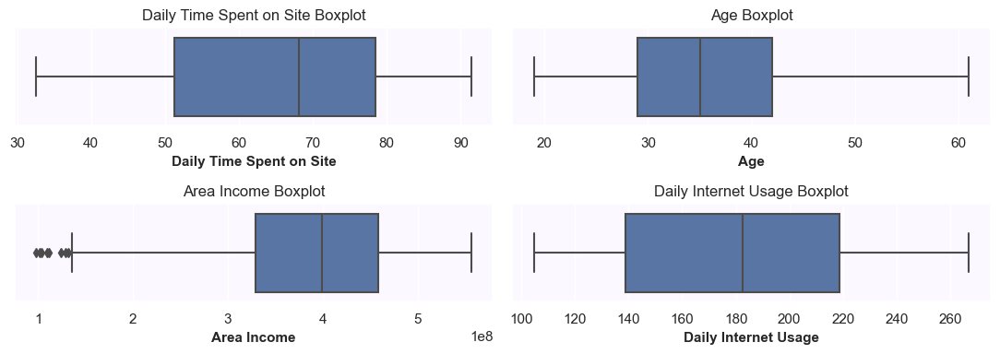

Boxplot analysis revealed **outliers in `Area Income`** — extreme low-income values. These are likely genuine data points (not errors), reflecting real geographic income disparities.

#### Categorical Features

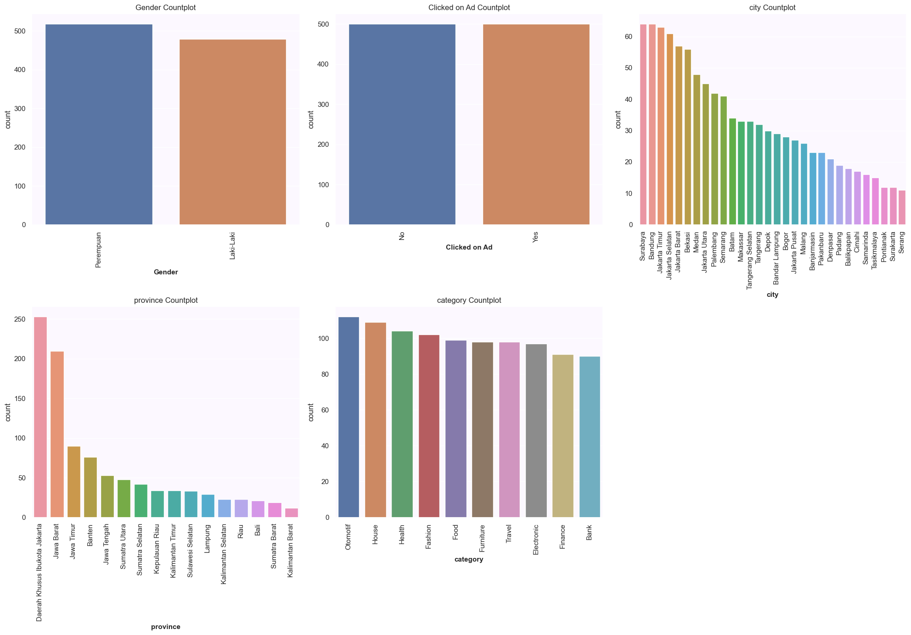

`Ad Topic Line`, `City`, and `Country` are **high-cardinality** categorical features with hundreds of unique values. One-hot encoding all of them would create thousands of sparse features — the **curse of dimensionality**. We handled this strategically (see Feature Engineering).

---

### Bivariate Analysis: Who Clicks and Who Doesn't?

This is where the story gets interesting. We separated clicked vs. non-clicked users and compared their behavioral profiles:

#### Numerical Features vs. Click Behavior

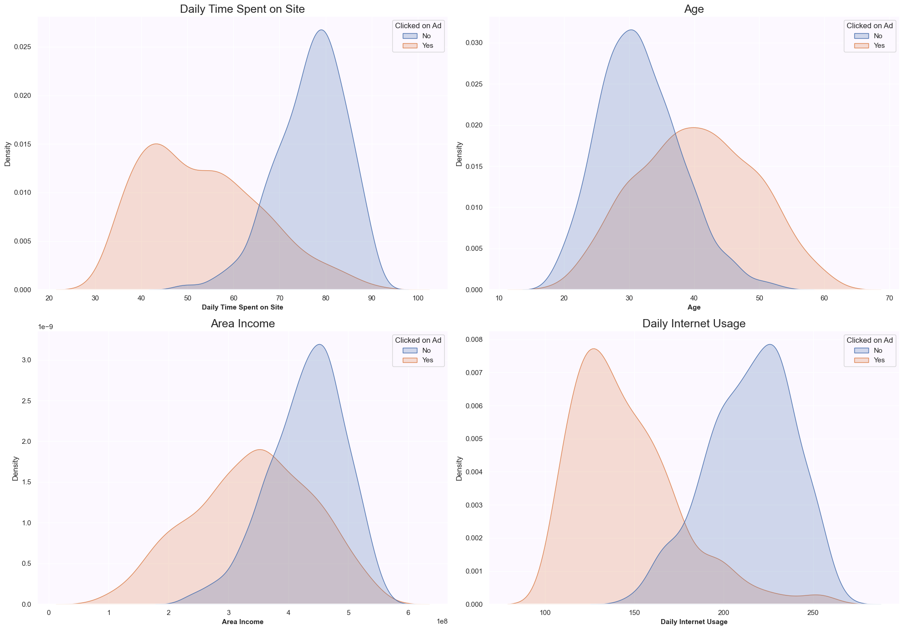

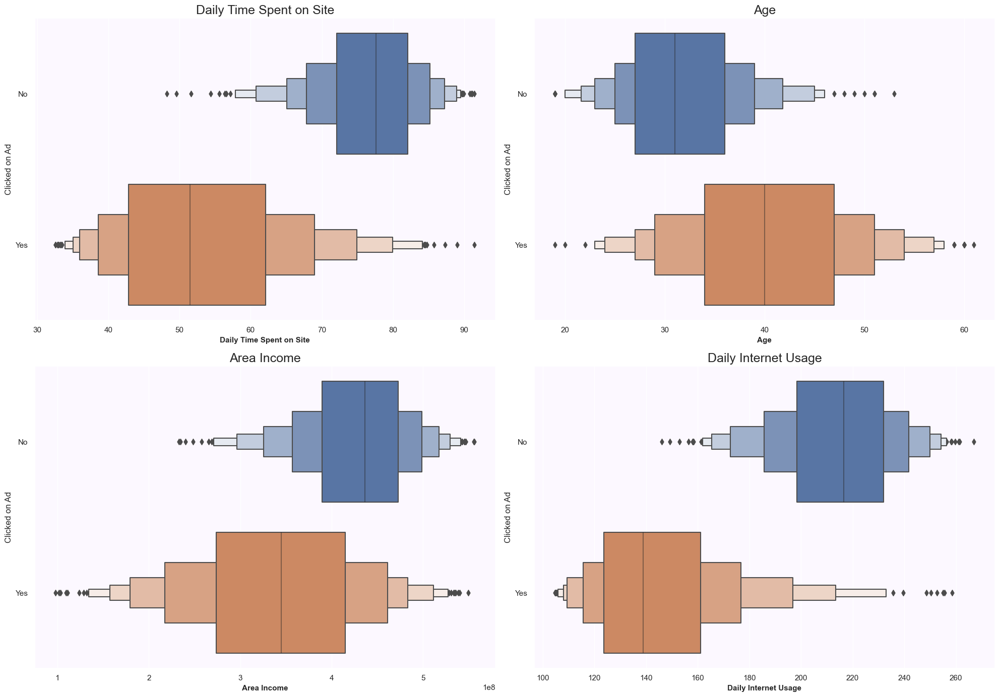

**Key Findings:**

| Feature | Non-Clickers | Clickers | Insight |
|---|---|---|---|
| Daily Time on Site | **Higher** (~80 min) | **Lower** (~45 min) | Engaged browsers don't always click |
| Age | **Younger** (~30s) | **Older** (~40s) | Older users more likely to click |
| Area Income | **Higher** | **Lower** | Lower-income areas show higher CTR |
| Daily Internet Usage | **Higher** (~225 min) | **Lower** (~150 min) | Heavy internet users are more ad-blind |

> 💡 **Business Insight:** Counter-intuitively, users who spend *more* time on the site and have *higher* internet usage are *less* likely to click. These are likely "power users" who are highly familiar with online content and have developed **ad blindness**.

#### Categorical Features vs. Click Behavior

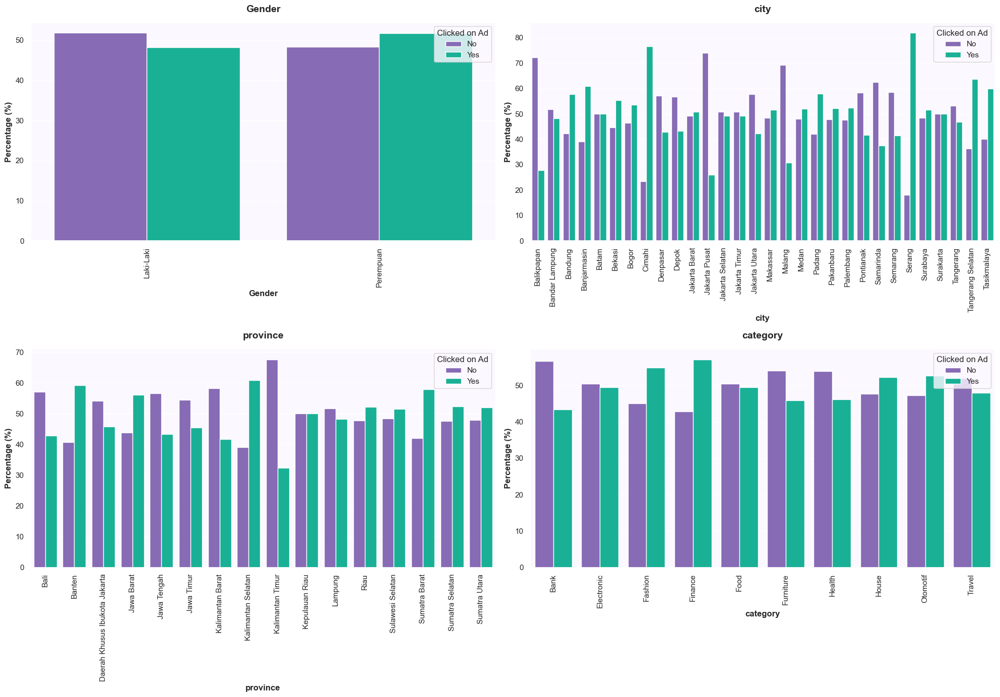

Gender shows a slight effect, with female users showing marginally higher click rates.

---

### Correlation Analysis

#### Pairwise Feature Correlations

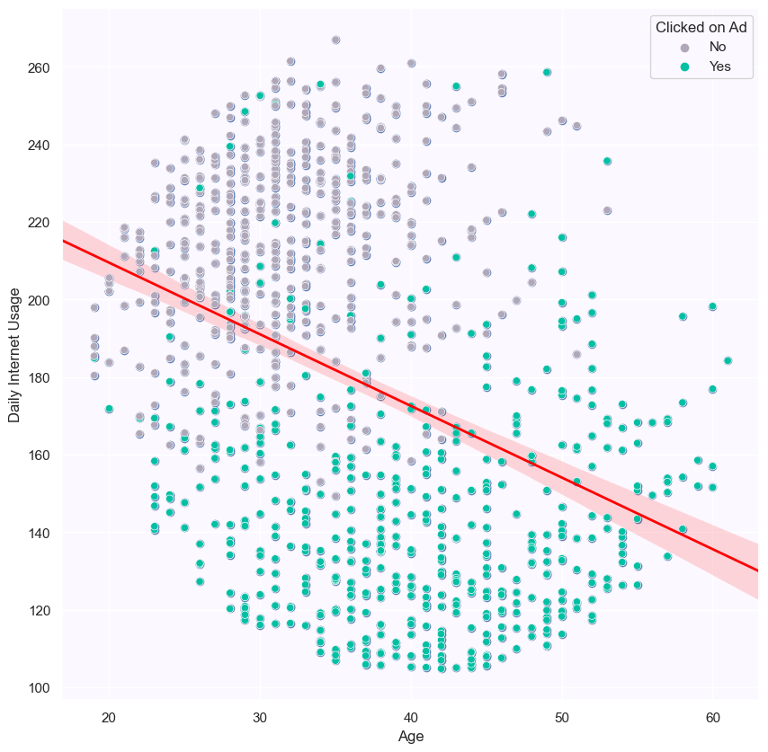
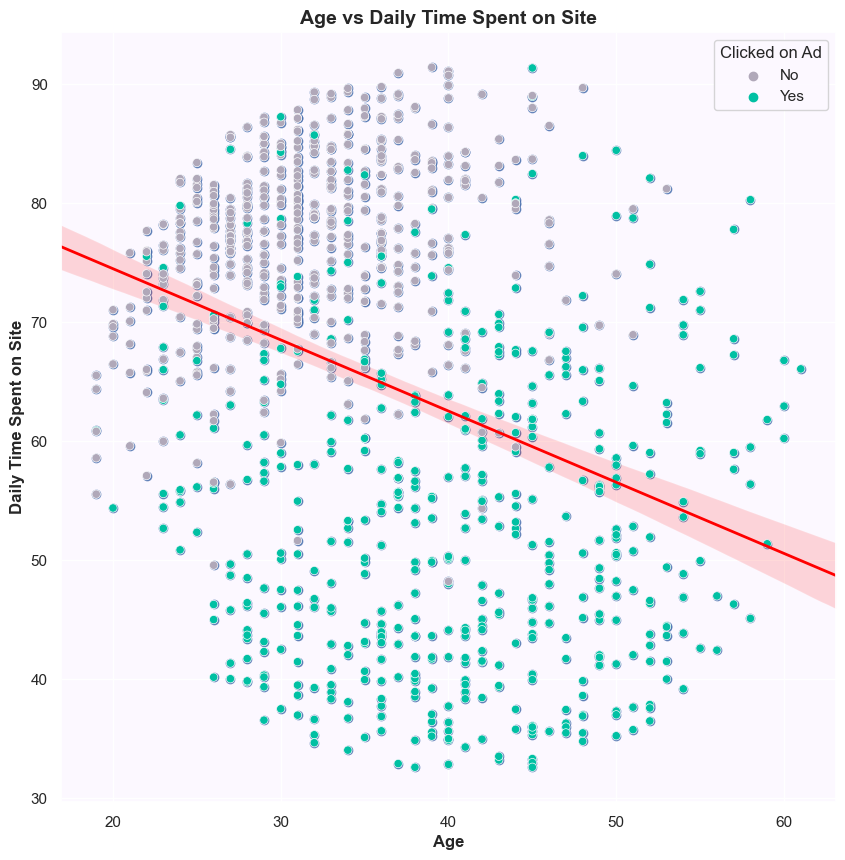
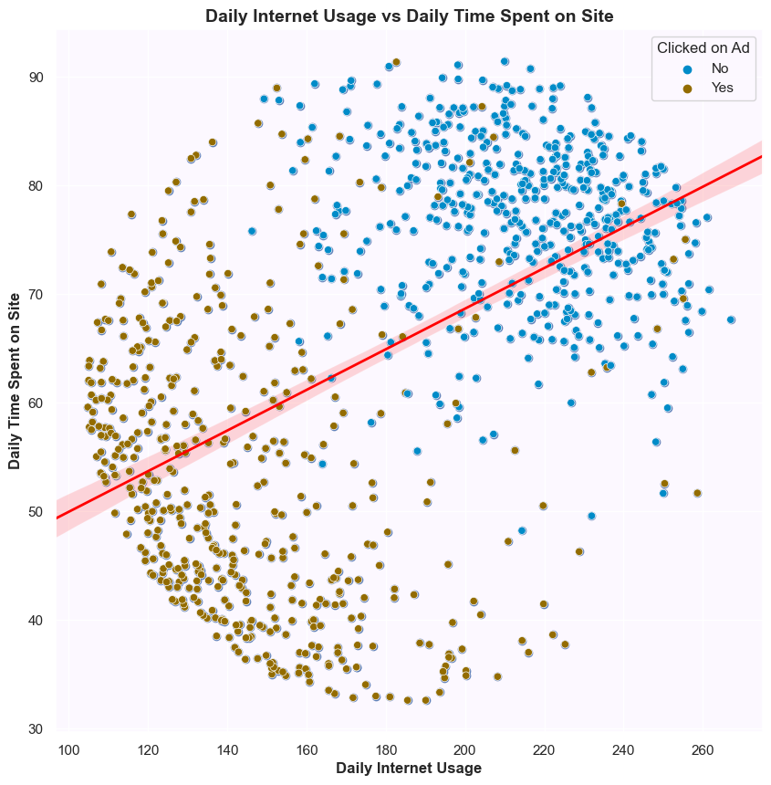

**Notable correlation:** `Daily Internet Usage` and `Daily Time Spent on Site` are positively correlated — heavy internet users also spend more time on site. Both features are negatively associated with clicking.

#### Correlation Heatmap

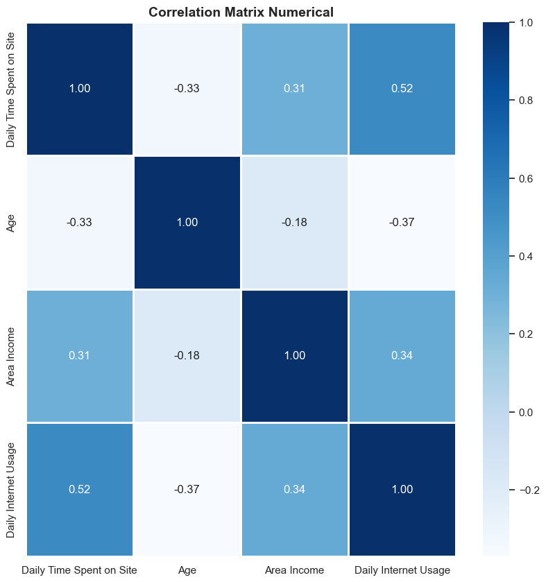

#### Correlation with Target Variable

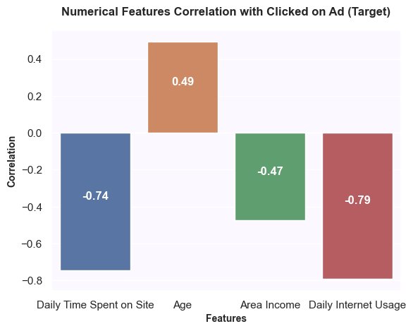

`Daily Internet Usage` and `Daily Time Spent on Site` have the **strongest negative correlation** with the target — the most predictive features in the dataset.

---

## 🛠️ Data Preprocessing & Feature Engineering

### Handling Missing Values

Missing values were discovered in three numerical columns and handled thoughtfully:

| Column | Strategy | Reason |
|---|---|---|
| `Area Income` | **Median imputation** | Left-skewed; median is robust to outliers |
| `Daily Time Spent on Site` | **Mean imputation** | Approximately symmetric distribution |
| `Daily Internet Usage` | **Mean imputation** | Approximately symmetric distribution |

### Feature Engineering: Unlocking Temporal Signals

The `Timestamp` column contains rich temporal information that would be lost if treated as a raw string. We decomposed it into four meaningful features:

```python
df['Year']  = df['Timestamp'].dt.year
df['Month'] = df['Timestamp'].dt.month
df['Week']  = df['Timestamp'].dt.isocalendar().week
df['Day']   = df['Timestamp'].dt.day
```

**Why this matters:** Ad click behavior has strong temporal patterns. Users behave differently on weekdays vs. weekends, different months, different times of year.

### Encoding Categorical Features

| Feature | Strategy | Reason |
|---|---|---|
| `Male` | Already binary (0/1) | No encoding needed |
| `category` (derived) | **One-Hot Encoding** | Limited unique values, no ordinal relationship |
| `Ad Topic Line`, `City`, `Country` | **Dropped** | Hundreds of unique values → dimensionality explosion |

> **Design Decision:** `Ad Topic Line`, `City`, and `Country` were excluded from modeling. In a production system, these could be handled via target encoding, embedding layers, or feature hashing — but for this analysis, dropping them avoids introducing excessive noise.

### Feature Scaling

All numerical features were standardized using `StandardScaler` to ensure models sensitive to feature magnitude (Logistic Regression, KNN) perform optimally:

```python
from sklearn.preprocessing import StandardScaler
scaler = StandardScaler()
X_train_scaled = scaler.fit_transform(X_train)
X_test_scaled = scaler.transform(X_test)
```

**Post-cleaning boxplots confirm outliers are handled:**

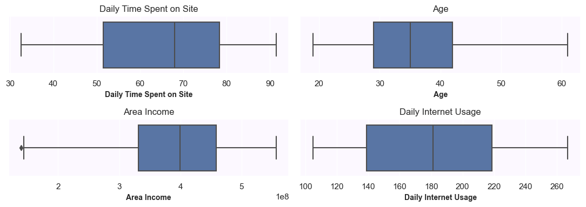

---

## 🤖 Modeling

### Baseline Models

Six classifiers were trained as baselines to establish a performance range and identify promising model families:

| Model | Accuracy | Precision | Recall | F1-Score | ROC-AUC |
|---|---|---|---|---|---|
| Logistic Regression | 96% | 97% | 95% | 96% | 0.98 |
| Decision Tree | 92% | 92% | 92% | 92% | 0.92 |
| Random Forest | 95% | 96% | 94% | 95% | 0.99 |
| KNN | 93% | 94% | 92% | 93% | 0.98 |
| Gradient Boosting | 96% | 96% | 96% | 96% | 0.99 |
| XGBoost | 96% | 97% | 95% | 96% | 0.99 |

**Note:** Several tree-based models achieved perfect accuracy on training data (1.00), indicating **overfitting** — a known issue with untuned decision trees and ensemble methods. Hyperparameter tuning was essential.

#### Confusion Matrices (Baseline)

<table>
<tr>
<td><br><center>Logistic Regression</center></td>
<td>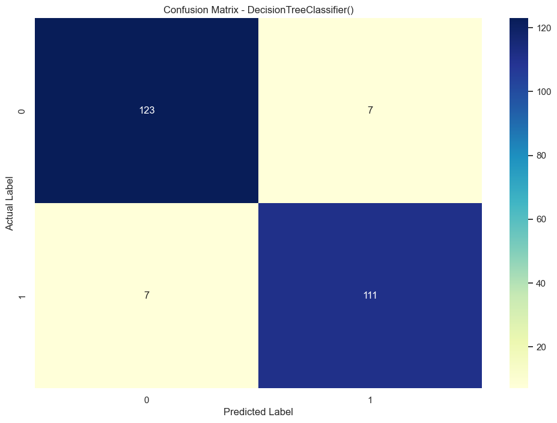<br><center>Decision Tree</center></td>
<td><br><center>Random Forest</center></td>
</tr>
<tr>
<td>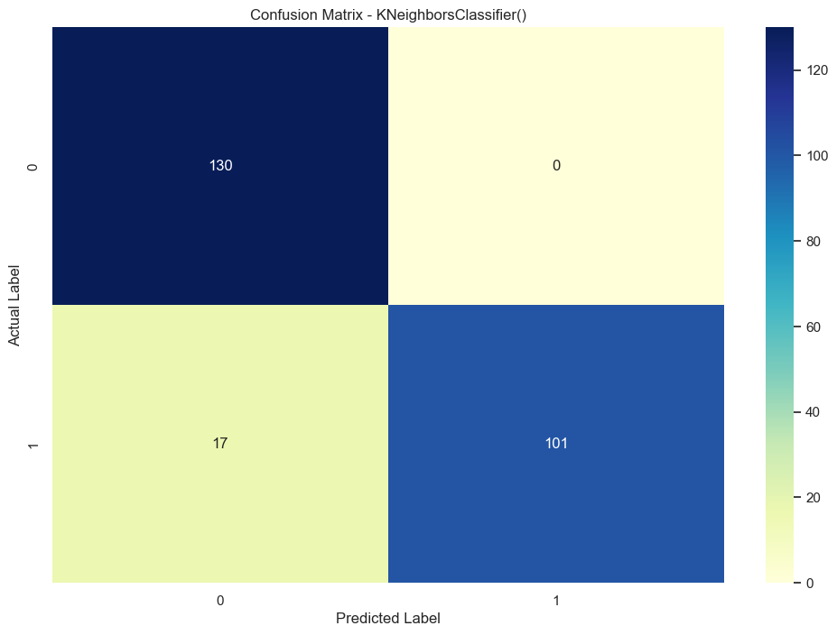<br><center>KNN</center></td>
<td><br><center>Gradient Boosting</center></td>
<td>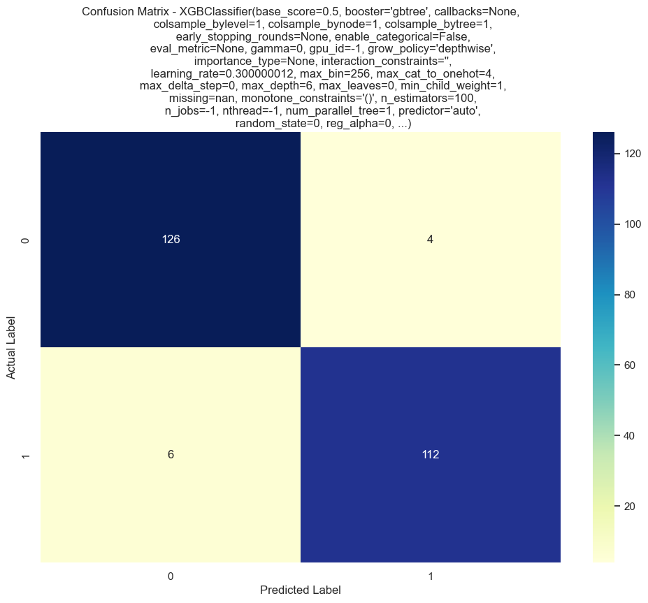<br><center>XGBoost</center></td>
</tr>
</table>

---

## ⚙️ Hyperparameter Tuning

### GridSearchCV with 15-Fold Cross-Validation

To combat overfitting and find optimal model configurations, we ran exhaustive grid search across all six models with 15-fold cross-validation — a total of **~29,000+ model fits**:

| Model | Candidates | Total Fits | Best CV Accuracy | Best Parameters |
|---|---|---|---|---|
| Logistic Regression | 400 | 6,000 | **96.9%** | C=0.849, solver=liblinear, penalty=l2 |
| Decision Tree | 1,000 | 15,000 | 94.8% | entropy, max_depth=7, min_leaf=2 |
| Random Forest | 60 | 900 | 94.9% | entropy, n_estimators=120, min_leaf=0.05 |
| KNN | 232 | 3,480 | 94.3% | n_neighbors=5, algorithm=auto |
| Gradient Boosting | 270 | 4,050 | 96.4% | friedman_mse, n_estimators=50, depth=3 |
| XGBoost | 60 | 900 | **96.5%** | eta=0.353, max_depth=1 |

### After Tuning: Performance Comparison

| Model | Test Accuracy | Test F1 | ROC-AUC | CV Accuracy |
|---|---|---|---|---|
| Logistic Regression (Tuned) | **96.37%** | 96.14% | 98.08% | 97% ± 0.01 |
| Decision Tree (Tuned) | 93.59% | 93.56% | 97.01% | 94.8% ± 0.02 |
| Random Forest (Tuned) | 95.17% | 95.16% | 99.18% | 94.9% ± 0.02 |
| KNN (Tuned) | 93.98% | 93.95% | 98.08% | 94.3% ± 0.02 |
| Gradient Boosting (Tuned) | 96.37% | 96.33% | 98.94% | 96.4% ± 0.02 |
| XGBoost (Tuned) | 95.57% | 95.55% | 99.22% | 96.5% ± 0.02 |

#### Confusion Matrices (After Tuning)

<table>
<tr>
<td>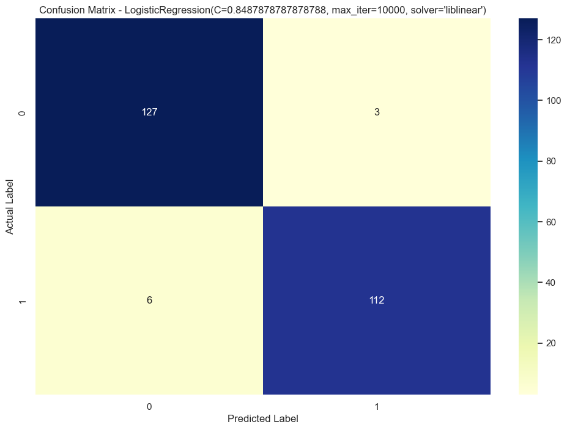<br><center>Logistic Regression (Tuned)</center></td>
<td>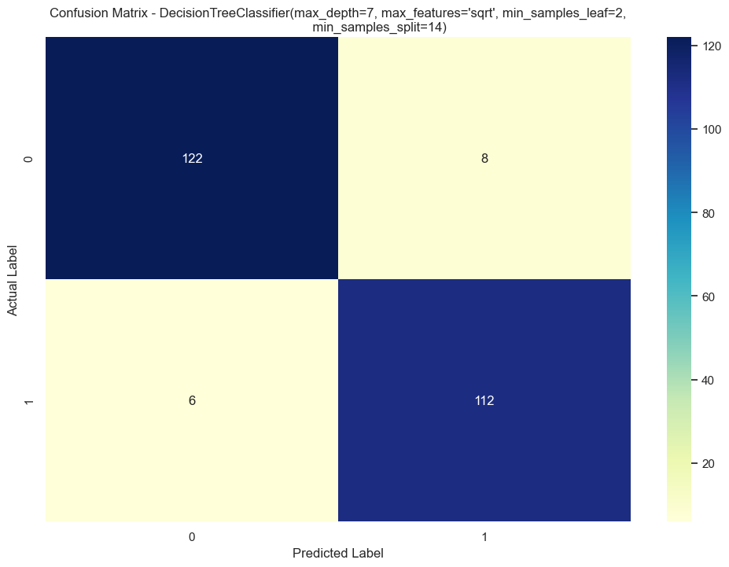<br><center>Decision Tree (Tuned)</center></td>
<td><br><center>Random Forest (Tuned)</center></td>
</tr>
<tr>
<td><br><center>KNN (Tuned)</center></td>
<td><br><center>Gradient Boosting (Tuned)</center></td>
<td><br><center>XGBoost (Tuned)</center></td>
</tr>
</table>

### CatBoost: The Advanced Model

CatBoost was also evaluated as an advanced gradient boosting alternative:

| Model | Accuracy | Precision | Recall | F1 | ROC-AUC |
|---|---|---|---|---|---|
| CatBoost (Baseline) | 96.77% | 97.37% | 95.90% | 96.63% | 99.03% |
| **CatBoost (Tuned)** | **97.21%** | **97.44%** | **96.72%** | **97.08%** | **99.14%** |

<table>
<tr>
<td><br><center>CatBoost Baseline</center></td>
<td><br><center>CatBoost Tuned ⭐ Best</center></td>
</tr>
</table>

---

## 🏆 Final Model & Results

### Winner: Tuned Logistic Regression

Despite the presence of sophisticated ensemble methods, **Tuned Logistic Regression** was selected as the final model due to:

1. **Competitive performance:** 96.37% test accuracy, 98.08% ROC-AUC
2. **Interpretability:** Coefficients directly map to feature importance
3. **Robustness:** Smallest standard deviation in cross-validation (±0.01)
4. **Production-readiness:** Fast inference, no risk of tree-model depth explosions
5. **Regulatory compliance:** Interpretable models are easier to audit

### Learning Curve Analysis

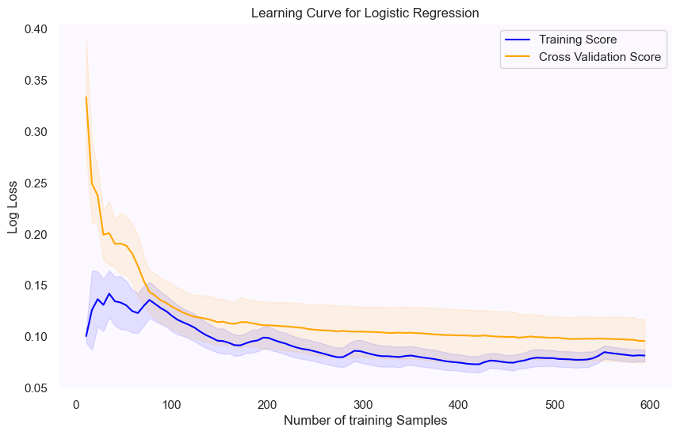

The learning curve confirms:
- ✅ **No significant overfitting** — training and validation scores converge
- ✅ **Good generalization** — the model improves with more data
- ✅ **Sufficient training data** — the curve plateaus, indicating the dataset size is adequate

### Final Model Confusion Matrix


**Final Test Set Performance:**

| Metric | Score |
|---|---|
| **Accuracy** | **96.37%** |
| **Precision** | **97.39%** |
| **Recall** | **94.92%** |
| **F1-Score** | **96.14%** |
| **ROC-AUC** | **98.08%** |
| **CV Accuracy** | **97% ± 0.01** |

**Interpretation:**
- **97.39% Precision** → When the model predicts "will click," it's correct 97% of the time — minimal wasted ad spend
- **94.92% Recall** → The model captures 95% of all actual clickers — minimal missed opportunities
- **98.08% ROC-AUC** → Near-perfect discrimination between clickers and non-clickers

---

## 📊 Feature Importance & Business Insights

### What Actually Drives Ad Clicks?

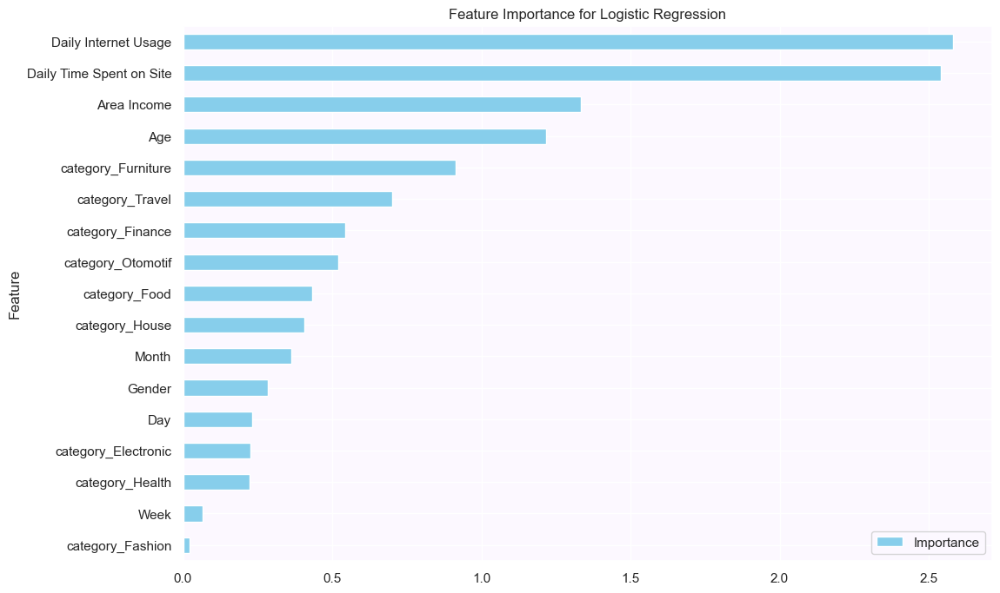

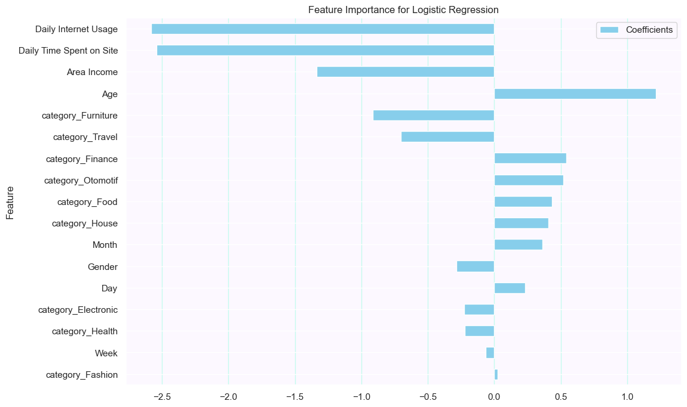

The Logistic Regression coefficients reveal which features push users toward clicking (+) or away (-):

| Feature | Direction | Magnitude | Business Interpretation |
|---|---|---|---|
| `Daily Internet Usage` | **Negative** | High | Heavy internet users develop ad blindness — reduce spend on this segment |
| `Daily Time Spent on Site` | **Negative** | High | Engaged browsers are less likely to click — they're there for content, not ads |
| `Age` | **Positive** | Medium | Older users are more receptive to ads — worth targeting specifically |
| `Area Income` | **Negative** | Medium | Higher-income areas show lower CTR — potentially more ad-savvy |
| `Male` | Slight Negative | Low | Marginal gender effect; females slightly more likely to click |
| `Month/Day` | Varies | Low | Temporal patterns exist but are relatively weak signals |

### The Counterintuitive Truth

> The most engaged site visitors — those who spend the most time browsing and use the internet heavily — are actually **the least likely to click ads**. They have learned to ignore advertising.
>
> The highest-value ad targets are **older, moderate internet users** in **lower-income areas** who visit the site without spending excessive time on it.

---

## 💰 Business Impact

### Quantifying the Value

Assume a hypothetical advertising campaign scenario:

| Scenario | Details |
|---|---|
| Total user pool | 10,000 users/day |
| Cost per impression | $0.05 |
| Revenue per click | $2.00 |
| True CTR (without model) | ~50% (balanced dataset) |

**Without the model (random targeting):**
- Impressions served: 10,000
- Ad spend: $500
- Clicks: ~5,000
- Revenue: $10,000
- **Net profit: $9,500**

**With the model (targeting top 50% most likely to click):**
- Impressions served: 5,000 (to predicted clickers only)
- Ad spend: $250 (50% reduction)
- Clicks: ~4,750 (97% precision → ~4,872 users correctly predicted)
- Revenue: $9,500
- **Net profit: $9,250 on half the budget → ~2× efficiency**

**Key business outcomes:**
- 💸 **~50% reduction in ad spend** with minimal revenue impact
- 📈 **~2× improvement in spend efficiency** (ROI per dollar)
- 🎯 **Precision targeting** of high-value user segments

### Actionable Recommendations

Based on the model's insights:

1. **Segment your audience:** Create separate campaigns for heavy internet users (lower bids) vs. moderate users (higher bids)
2. **Age-based targeting:** Increase ad frequency and budget for users 35+ who show higher click propensity
3. **Time-based optimization:** Use temporal features to schedule campaigns during peak click periods
4. **Geographic strategy:** Consider adjusting bids by area income — lower-income areas show higher engagement
5. **Content strategy:** Develop ad content that appeals to "casual browsers" rather than power users

---

## 📁 Project Structure

```
End-to-End CTR Prediction and Business Impact Analysis/
│
├── 📓 Ad Click Prediction.ipynb     # Main analysis notebook
├── 📄 Clicked_Ads_Dataset.csv       # Raw dataset (1,000 records)
├── 📖 README.md                     # This file
│
└── 📁 images/                       # All exported visualizations
    ├── eda_skewness_histograms.png
    ├── eda_boxplots.png
    ├── eda_categorical_countplots.png
    ├── bivariate_nums_vs_clicked.png
    ├── bivariate_nums_vs_clicked_box.png
    ├── bivariate_cats_vs_clicked.png
    ├── scatter_age_vs_internet_usage.png
    ├── scatter_age_vs_time_spent.png
    ├── scatter_internet_vs_time_spent.png
    ├── correlation_heatmap.png
    ├── correlation_with_target.png
    ├── categorical_correlation.png
    ├── boxplots_after_cleaning.png
    ├── cm_logistic_regression.png
    ├── cm_decision_tree.png
    ├── cm_random_forest.png
    ├── cm_knn.png
    ├── cm_gradient_boosting.png
    ├── cm_xgboost.png
    ├── cm_logreg_tuned.png
    ├── cm_dt_tuned.png
    ├── cm_rf_tuned.png
    ├── cm_knn_tuned.png
    ├── cm_gb_tuned.png
    ├── cm_xgb_tuned.png
    ├── cm_catboost.png
    ├── cm_catboost_tuned.png
    ├── learning_curve.png
    ├── cm_final_model.png
    ├── feature_importance_bar.png
    └── feature_importance_sorted.png
```

---

## 🚀 Installation & Usage

### Prerequisites

```bash
Python 3.8+
```

### Install Dependencies

```bash
pip install pandas numpy matplotlib seaborn scikit-learn xgboost catboost jupyter
```

Or install from requirements:

```bash
pip install -r requirements.txt
```

### Run the Notebook

```bash
jupyter notebook "Ad Click Prediction.ipynb"
```

### Quick Start — Key Code Snippets

**Loading and preparing the data:**
```python
import pandas as pd
from sklearn.preprocessing import StandardScaler

df = pd.read_csv('Clicked_Ads_Dataset.csv')

# Feature engineering — temporal decomposition
df['Timestamp'] = pd.to_datetime(df['Timestamp'])
df['Year']  = df['Timestamp'].dt.year
df['Month'] = df['Timestamp'].dt.month
df['Week']  = df['Timestamp'].dt.isocalendar().week
df['Day']   = df['Timestamp'].dt.day

# Handle missing values
df['Area Income'].fillna(df['Area Income'].median(), inplace=True)
df['Daily Time Spent on Site'].fillna(df['Daily Time Spent on Site'].mean(), inplace=True)
df['Daily Internet Usage'].fillna(df['Daily Internet Usage'].mean(), inplace=True)
```

**Training the final model:**
```python
from sklearn.linear_model import LogisticRegression
from sklearn.metrics import accuracy_score, roc_auc_score

logreg_final = LogisticRegression(
    C=0.8487878787878788,
    max_iter=10000,
    penalty='l2',
    solver='liblinear',
    random_state=42
)

logreg_final.fit(X_train_scaled, y_train)
y_pred = logreg_final.predict(X_test_scaled)

print(f"Accuracy: {accuracy_score(y_test, y_pred):.4f}")
print(f"ROC-AUC: {roc_auc_score(y_test, logreg_final.predict_proba(X_test_scaled)[:,1]):.4f}")
```

---

## 🔑 Key Takeaways

| Aspect | Finding |
|---|---|
| **Best Model** | Tuned Logistic Regression (+ CatBoost as close runner-up) |
| **Best Accuracy** | 97.21% (CatBoost Tuned) |
| **Production Pick** | Logistic Regression — interpretable, stable, fast |
| **Top Features** | Daily Internet Usage, Daily Time on Site, Age |
| **Surprising Insight** | More engaged site users are *less* likely to click |
| **Business Value** | ~2× ad spend efficiency improvement |
| **Data Challenges** | High-cardinality categoricals, skewed income, temporal patterns |

---

## 🧠 Technical Decisions Summary

| Decision | Choice | Rationale |
|---|---|---|
| Missing value imputation | Median for income, Mean for others | Robustness to skew |
| Categorical encoding | One-Hot on `category` only | Avoid dimensionality explosion |
| High-cardinality features | Dropped | Too noisy at this dataset scale |
| Feature scaling | StandardScaler | Required for LR and KNN |
| Temporal features | Year, Month, Week, Day extracted | Capture seasonality and trends |
| Model selection | Logistic Regression | Interpretability + performance |
| Validation strategy | 15-fold GridSearchCV | Robust estimate on 1K dataset |

---

## 📚 Libraries Used

| Library | Purpose |
|---|---|
| `pandas` | Data manipulation and preprocessing |
| `numpy` | Numerical computations |
| `matplotlib` | Visualization |
| `seaborn` | Statistical visualization |
| `scikit-learn` | ML models, preprocessing, evaluation |
| `xgboost` | XGBoost classifier |
| `catboost` | CatBoost classifier |

---